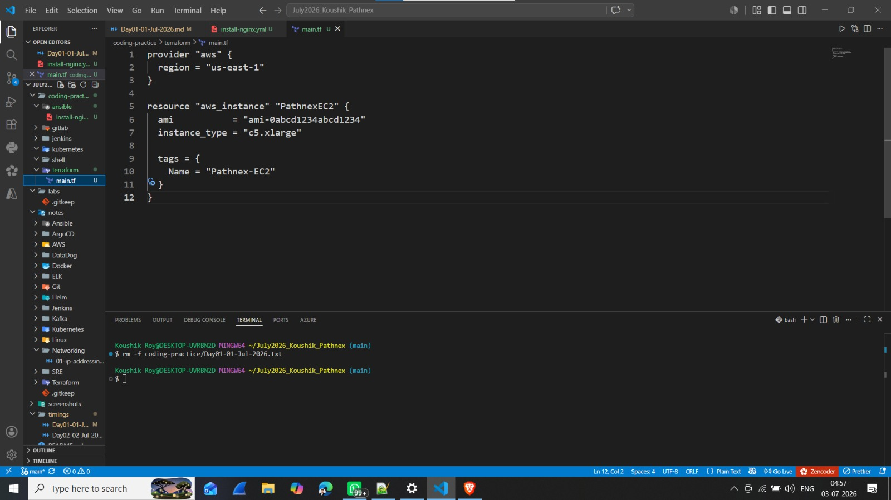

## 💻 Day 01 - Coding Practice (30-Day DevOps Hands-On Challenge - Pathnex)

### 1. Ansible Task — Install Nginx on Pathnex Server

**File:** [`ansible/install-nginx.yml`](../coding-practice/ansible/install-nginx.yml)

**What I Learned:**
- Ansible playbook structure
- YAML syntax
- `yum` module for package installation
- `become: yes` for sudo privileges

**📸 VS Code Screenshot:**

---

### 2. Terraform Task — Create EC2 (c5.xlarge)

**File:** [`terraform/main.tf`](../coding-practice/terraform/main.tf)

**What I Learned:**
- Terraform HCL syntax
- AWS provider configuration
- Resource definition (EC2)
- Tagging resources

**📸 VS Code Screenshot:**

---

### 3. Kubernetes Task — Create Nginx Pod

**File:** [`kubernetes/pathnex-pod.yaml`](../coding-practice/kubernetes/pathnex-pod.yaml)

**What I Learned:**
- Kubernetes YAML structure
- Pod definition
- Container specifications
- Port mapping

**📸 VS Code Screenshot:**

---

### 4. Shell Script — Print Date & Hostname

**File:** [`shell/date-hostname.sh`](../coding-practice/shell/date-hostname.sh)

**What I Learned:**
- Bash scripting basics
- `date` and `hostname` commands
- Variable substitution
- Making scripts executable

**📸 VS Code Screenshot:**

---

### 5. Jenkins Pipeline — Checkout Git

**File:** [`jenkins/Jenkinsfile`](../coding-practice/jenkins/Jenkinsfile)

**What I Learned:**
- Jenkins declarative pipeline syntax
- `git` step for checkout
- `sh` step for shell commands
- Stage structure

**📸 VS Code Screenshot:**

---

### 6. GitLab CI — Checkout Git

**File:** [`gitlab/.gitlab-ci.yml`](../coding-practice/gitlab/.gitlab-ci.yml)

**What I Learned:**
- GitLab CI YAML syntax
- Pipeline stages
- Script execution
- Repository cloning

**📸 VS Code Screenshot:**

---

## 📌 Key Takeaways (Day 01 Coding)

| Tool | Purpose |
|------|---------|
| **Ansible** | Configuration Management |
| **Terraform** | Infrastructure as Code |
| **Kubernetes** | Container Orchestration |
| **Shell Script** | Automation |
| **Jenkins** | CI/CD |
| **GitLab CI** | CI/CD |

> **Bhaiya's Note:** *"Rewrite all code from scratch."*