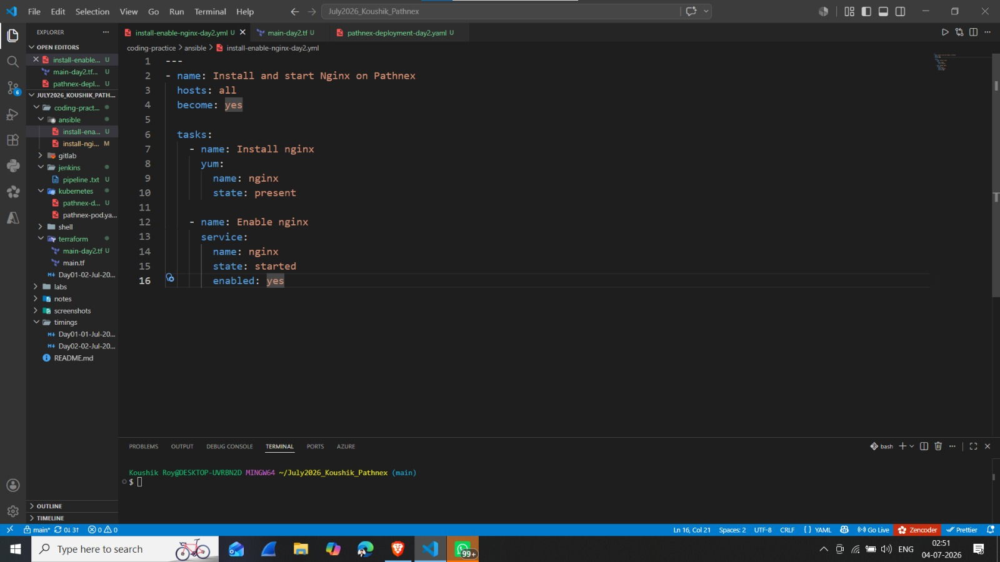
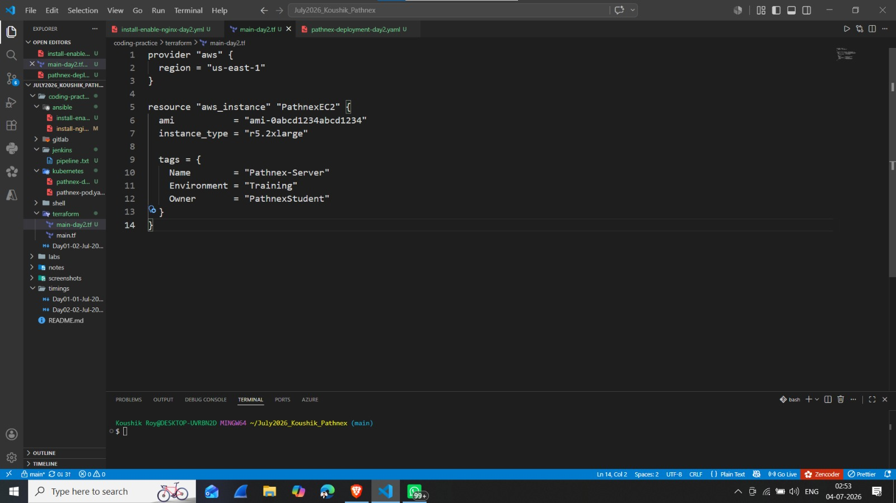
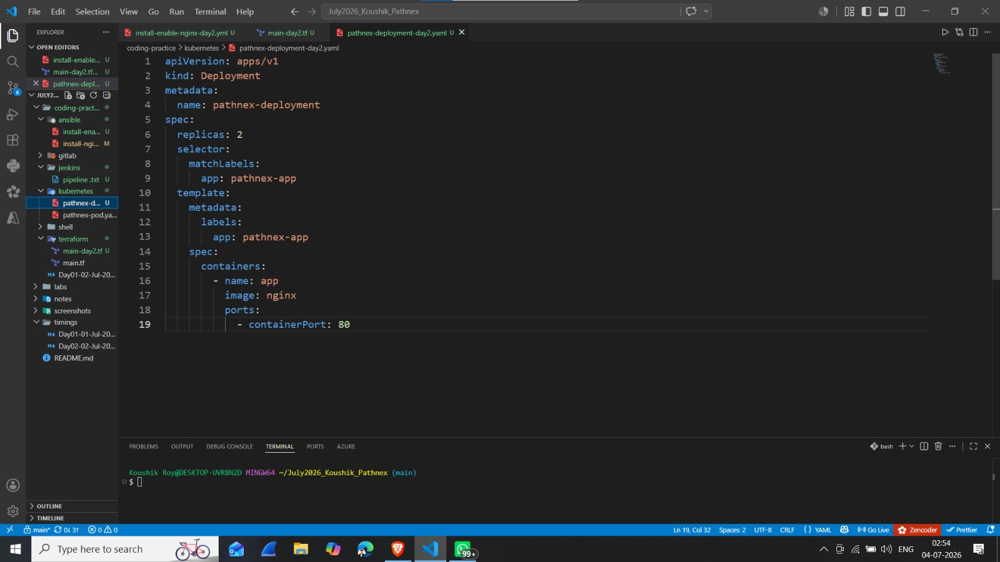
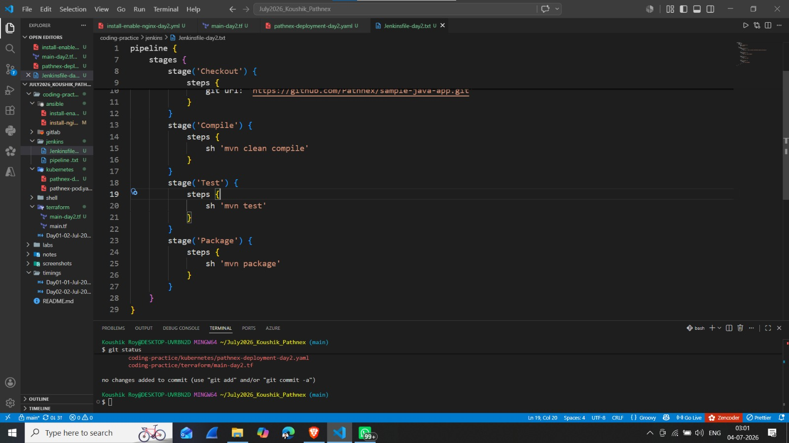

# Day 02 - Coding Practice (02 July 2026)

## 📌 30-Day DevOps Hands-On Challenge - Pathnex

### Tasks Completed Today:

---

### 1. Ansible Task — Install & Enable Nginx

**File:** [`ansible/install-enable-nginx-day2.yml`](./ansible/install-enable-nginx-day2.yml)

**What I Learned:**
- Installing packages with `yum`
- Starting and enabling services with `service` module
- `state: started` and `enabled: yes` for persistent service

**📸 VS Code Screenshot:**

---

### 2. Terraform Task — EC2 with Tags (r5.2xlarge)

**File:** [`terraform/main-day2.tf`](./terraform/main-day2.tf)

**What I Learned:**
- Added multiple tags to EC2 instance
- Using `r5.2xlarge` instance type
- Tagging best practices: Name, Environment, Owner

**📸 VS Code Screenshot:**

---

### 3. Kubernetes Task — Deployment with 2 Replicas

**File:** [`kubernetes/pathnex-deployment-day2.yaml`](./kubernetes/pathnex-deployment-day2.yaml)

**What I Learned:**
- Kubernetes Deployment vs Pod
- `replicas: 2` for scaling
- `selector` and `matchLabels` for matching pods
- Template section for pod specifications

**📸 VS Code Screenshot:**

---

### 4. Shell Script — Disk Usage

**File:** [`shell/disk-usage-day2.sh`](./shell/disk-usage-day2.sh)

**What I Learned:**
- `df -h` command for disk usage
- Human-readable format (`-h` flag)
- Simple script for system monitoring

**📸 VS Code Screenshot:**

---

### 5. Jenkins Pipeline — Maven Build

**File:** [`jenkins/Jenkinsfile-day2`](./jenkins/Jenkinsfile-day2)

**What I Learned:**
- Maven build lifecycle: `clean compile test package`
- Using `tools` block for Maven and JDK
- `sh` step for shell commands
- Complete CI pipeline stages

**📸 VS Code Screenshot:**

---

### 6. GitLab CI — Maven Build

**File:** [`gitlab/.gitlab-ci-day2.yml`](./gitlab/.gitlab-ci-day2.yml)

**What I Learned:**
- Multi-stage GitLab CI pipeline
- Using Maven Docker image
- `stages`: build, test, package
- `script` blocks for each stage

---

## 📌 Key Takeaways (Day 02 Coding)

| Tool | New Concept Learned |
|------|---------------------|
| **Ansible** | Service management (`state: started`, `enabled: yes`) |
| **Terraform** | EC2 tags (Name, Environment, Owner) |
| **Kubernetes** | Deployments with `replicas: 2` |
| **Shell Script** | `df -h` for disk monitoring |
| **Jenkins** | Maven build lifecycle (compile, test, package) |
| **GitLab CI** | Multi-stage pipeline with Maven |

> **Bhaiya's Note:** *"Rewrite all code from scratch."*