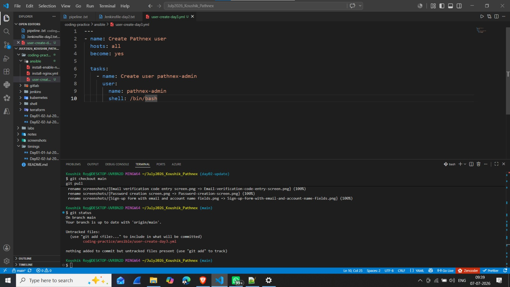
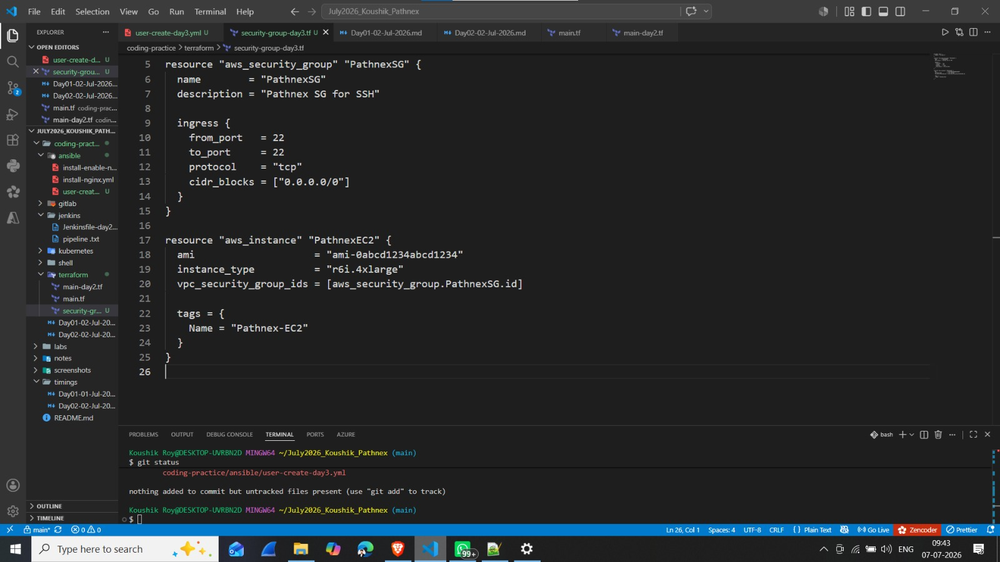
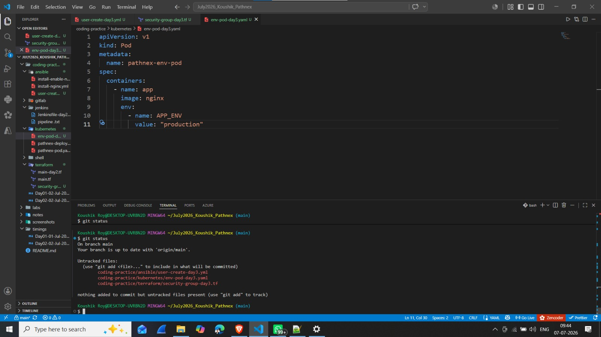
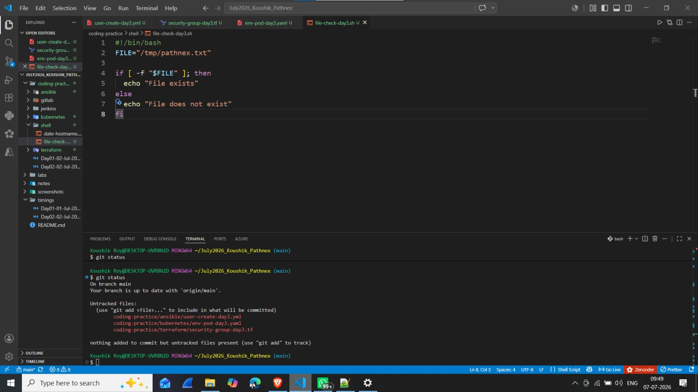
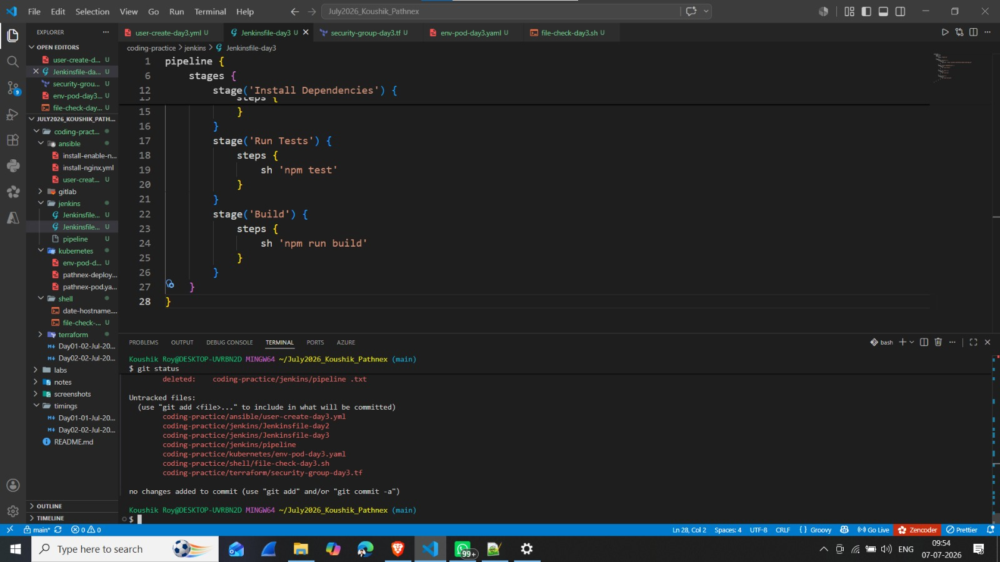
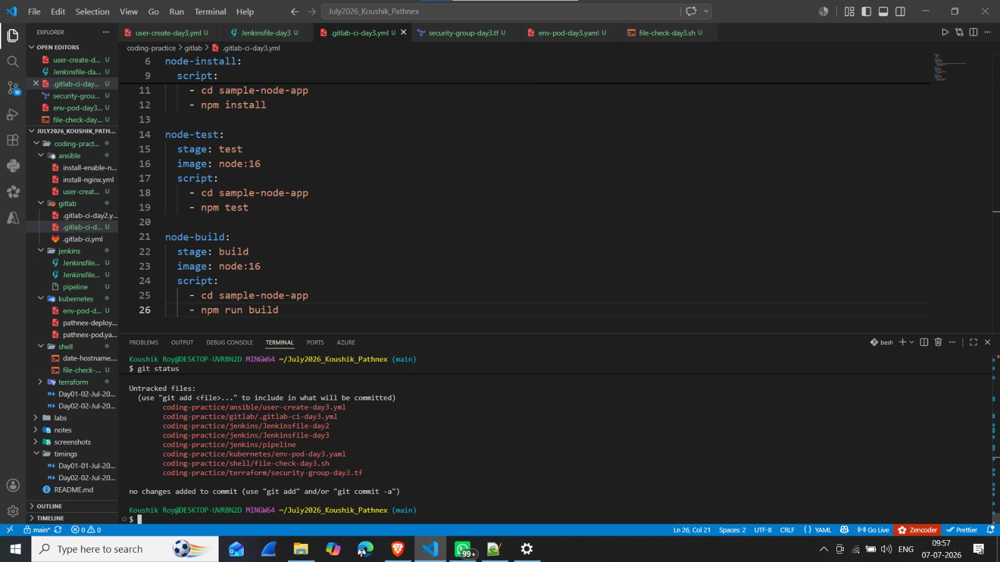

# Day 03 - Coding Practice (03 July 2026)

## 📌 30-Day DevOps Hands-On Challenge - Pathnex

### Tasks Completed Today:

---

### 1. Ansible Task — Create Pathnex User

**File:** [`ansible/user-create-day3.yml`](./ansible/user-create-day3.yml)

**What I Learned:**
- Creating users with Ansible `user` module
- Setting user shell to `/bin/bash`
- Using `become: yes` for administrative tasks

**📸 VS Code Screenshot:**

---

### 2. Terraform Task — Security Group (r6i.4xlarge EC2)

**File:** [`terraform/security-group-day3.tf`](./terraform/security-group-day3.tf)

**What I Learned:**
- Creating Security Groups in Terraform
- Allowing SSH ingress on port 22
- Associating SG with EC2 instance
- Using `r6i.4xlarge` instance type

**📸 VS Code Screenshot:**

---

### 3. Kubernetes Task — Pod with Environment Variables

**File:** [`kubernetes/env-pod-day3.yaml`](./kubernetes/env-pod-day3.yaml)

**What I Learned:**
- Adding environment variables to Kubernetes Pods
- `env` field under container spec
- Using `APP_ENV` variable for environment configuration

**📸 VS Code Screenshot:**

---

### 4. Shell Script — Check File Exists

**File:** [`shell/file-check-day3.sh`](./shell/file-check-day3.sh)

**What I Learned:**
- File existence check with `-f` flag
- `if-else` conditional statements in Bash
- Using variables for file paths

**📸 VS Code Screenshot:**

---

### 5. Jenkins Pipeline — NodeJS Build

**File:** [`jenkins/Jenkinsfile-day3`](./jenkins/Jenkinsfile-day3)

**What I Learned:**
- NodeJS pipeline with Jenkins
- `npm install` for dependencies
- `npm test` for running tests
- `npm run build` for building the app
- Using NodeJS-16 tool

**📸 VS Code Screenshot:**

---

### 6. GitLab CI — NodeJS Build

**File:** [`gitlab/.gitlab-ci-day3.yml`](./gitlab/.gitlab-ci-day3.yml)

**What I Learned:**
- Multi-stage GitLab CI pipeline
- Using NodeJS Docker image (`node:16`)
- `stages`: install, test, build
- `script` blocks for each stage

**📸 VS Code Screenshot:**

---

## 📌 Key Takeaways (Day 03 Coding)

| Tool | New Concept Learned |
|------|---------------------|
| **Ansible** | User creation with `user` module |
| **Terraform** | Security Groups & EC2 association |
| **Kubernetes** | Environment variables in Pods (`env:`) |
| **Shell Script** | File existence check (`if -f`) |
| **Jenkins** | NodeJS pipeline (`npm install, test, build`) |
| **GitLab CI** | NodeJS multi-stage pipeline |

> **Bhaiya's Note:** *"Rewrite all code from scratch."*