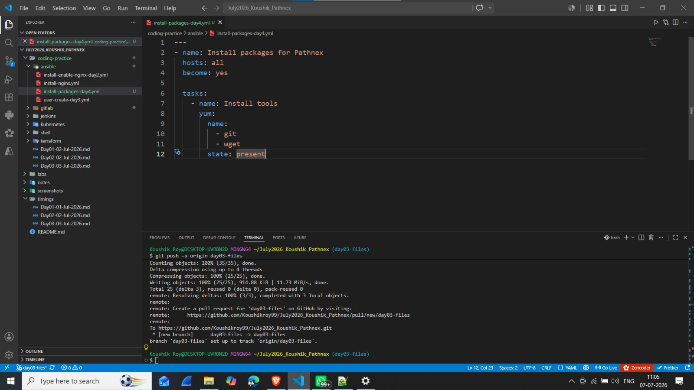
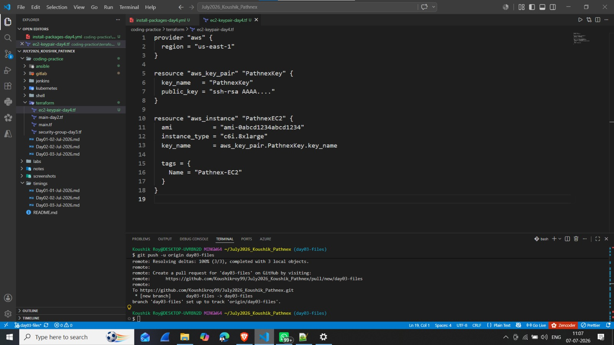
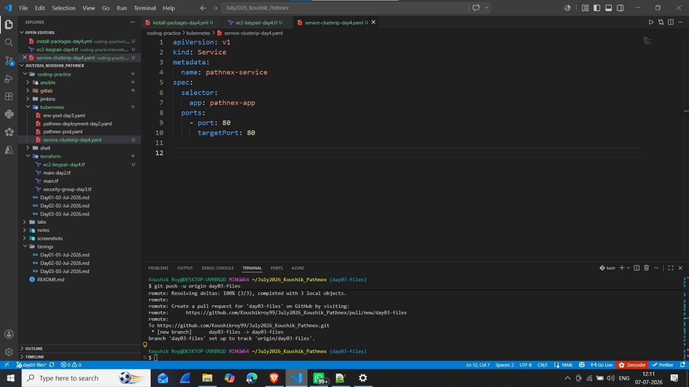
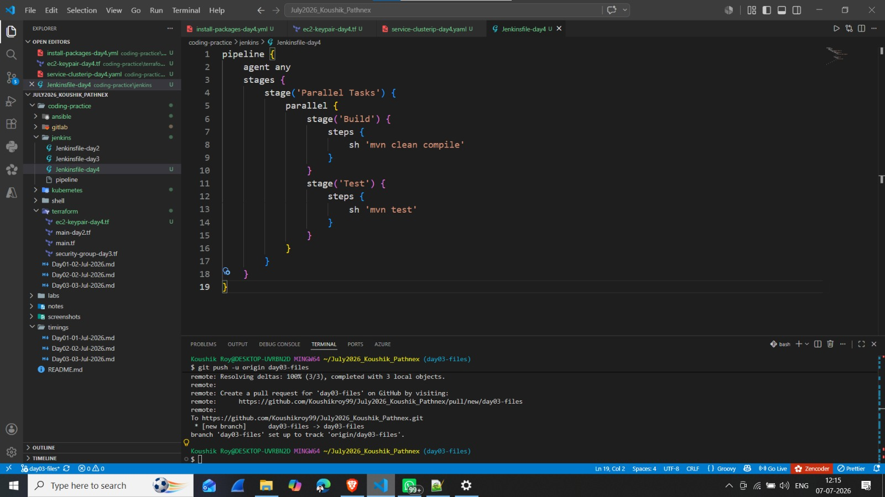
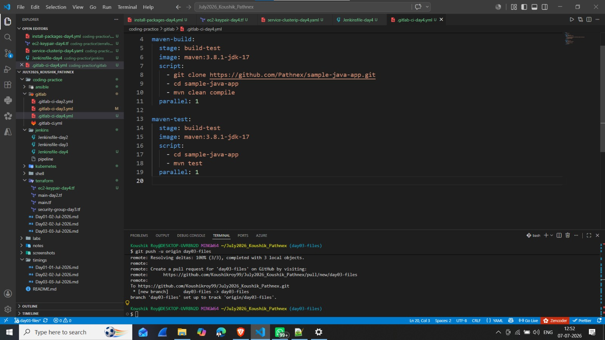

# Day 04 - Coding Practice (04 July 2026)

## 📌 30-Day DevOps Hands-On Challenge - Pathnex

### Tasks Completed Today:

---

### 1. Ansible Task — Install Multiple Packages

**File:** [`ansible/install-packages-day4.yml`](./ansible/install-packages-day4.yml)

**What I Learned:**
- Installing multiple packages with a single `yum` task
- Using list syntax for `name` parameter
- Package management with Ansible

**📸 VS Code Screenshot:**

---

### 2. Terraform Task — EC2 with Key Pair (c6i.8xlarge)

**File:** [`terraform/ec2-keypair-day4.tf`](./terraform/ec2-keypair-day4.tf)

**What I Learned:**
- Creating EC2 Key Pair with Terraform (`aws_key_pair`)
- Referencing key pair in EC2 resource
- Using `c6i.8xlarge` instance type
- Managing public keys for SSH access

**📸 VS Code Screenshot:**

---

### 3. Kubernetes Task — Create ClusterIP Service

**File:** [`kubernetes/service-clusterip-day4.yaml`](./kubernetes/service-clusterip-day4.yaml)

**What I Learned:**
- Creating ClusterIP Service in Kubernetes
- Service `selector` for matching pods
- Port mapping (`port` and `targetPort`)
- Internal load balancing

**📸 VS Code Screenshot:**

---

### 4. Jenkins Pipeline — Parallel Build & Test

**File:** [`jenkins/Jenkinsfile-day4`](./jenkins/Jenkinsfile-day4)

**What I Learned:**
- Parallel execution in Jenkins pipeline
- `parallel` block with multiple stages
- Running build and test concurrently
- Improved pipeline performance

**📸 VS Code Screenshot:**

---

### 5. GitLab CI — Parallel Jobs

**File:** [`gitlab/.gitlab-ci-day4.yml`](./gitlab/.gitlab-ci-day4.yml)

**What I Learned:**
- Parallel jobs in GitLab CI
- `parallel: 1` for parallel execution
- Sharing same stage for multiple jobs
- Maven build and test in parallel

**📸 VS Code Screenshot:**

---

## 📌 Key Takeaways (Day 04 Coding)

| Tool | New Concept Learned |
|------|---------------------|
| **Ansible** | Installing multiple packages with list |
| **Terraform** | EC2 Key Pair integration |
| **Kubernetes** | ClusterIP Service for internal access |
| **Jenkins** | Parallel stages (`parallel` block) |
| **GitLab CI** | Parallel jobs (`parallel: 1`) |

> **Bhaiya's Note:** *"Rewrite all code from scratch."*