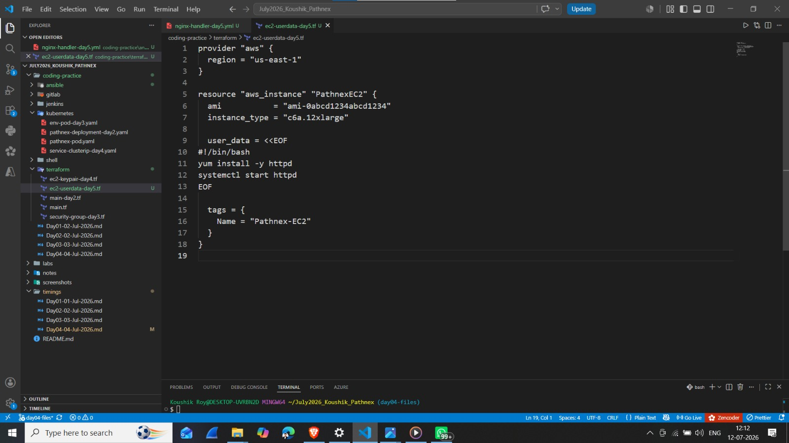
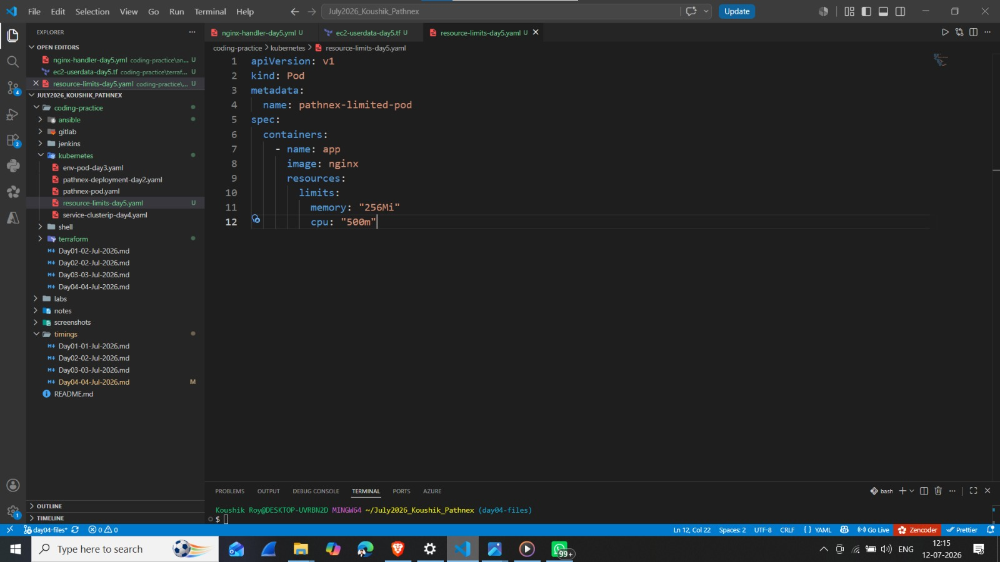
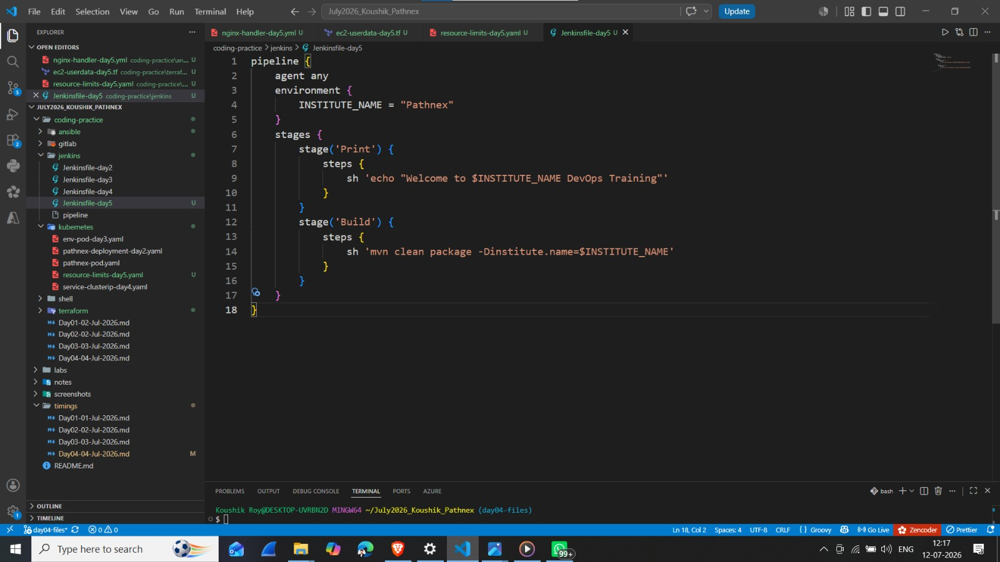
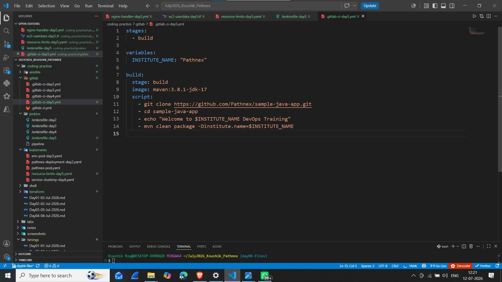

# Day 05 - Coding Practice (05 July 2026)

## 📌 30-Day DevOps Hands-On Challenge - Pathnex

### Tasks Completed Today:

---

### 1. Ansible Task — Handler to Restart Nginx

**File:** [`ansible/nginx-handler-day5.yml`](./ansible/nginx-handler-day5.yml)

**What I Learned:**
- Using `handlers` in Ansible
- `notify` to trigger handlers
- Restarting services with `state: restarted`
- Handler execution only if task changes

**📸 VS Code Screenshot:**

---

### 2. Terraform Task — EC2 with User Data (c6a.12xlarge)

**File:** [`terraform/ec2-userdata-day5.tf`](./terraform/ec2-userdata-day5.tf)

**What I Learned:**
- Using `user_data` in Terraform
- Running shell scripts at instance launch
- Installing `httpd` with yum
- Starting services with `systemctl`
- Using `c6a.12xlarge` instance type

**📸 VS Code Screenshot:**

---

### 3. Kubernetes Task — Resource Limits

**File:** [`kubernetes/resource-limits-day5.yaml`](./kubernetes/resource-limits-day5.yaml)

**What I Learned:**
- Setting resource `limits` for containers
- `memory` limit: `256Mi`
- `cpu` limit: `500m`
- Preventing resource starvation
- Ensuring fair resource allocation

**📸 VS Code Screenshot:**

---

### 4. Jenkins Pipeline — Environment Variables

**File:** [`jenkins/Jenkinsfile-day5`](./jenkins/Jenkinsfile-day5)

**What I Learned:**
- Using `environment` block in Jenkins
- Setting `INSTITUTE_NAME = "Pathnex"`
- Accessing variables with `$VARIABLE_NAME`
- Passing variables to Maven build
- Using `-Dinstitute.name=$INSTITUTE_NAME`

**📸 VS Code Screenshot:**

---

### 5. GitLab CI — Environment Variables

**File:** [`gitlab/.gitlab-ci-day5.yml`](./gitlab/.gitlab-ci-day5.yml)

**What I Learned:**
- Using `variables` block in GitLab CI
- Setting `INSTITUTE_NAME: "Pathnex"`
- Accessing variables with `$VARIABLE_NAME`
- Using variables in `script` section
- Maven build with variable

**📸 VS Code Screenshot:**

---

## 📌 Key Takeaways (Day 05 Coding)

| Tool | New Concept Learned |
|------|---------------------|
| **Ansible** | Handlers with `notify` and `state: restarted` |
| **Terraform** | `user_data` for startup scripts |
| **Kubernetes** | Resource limits (memory and cpu) |
| **Jenkins** | `environment` block for variables |
| **GitLab CI** | `variables` block for CI variables |

> **Bhaiya's Note:** *"Rewrite all code from scratch."*