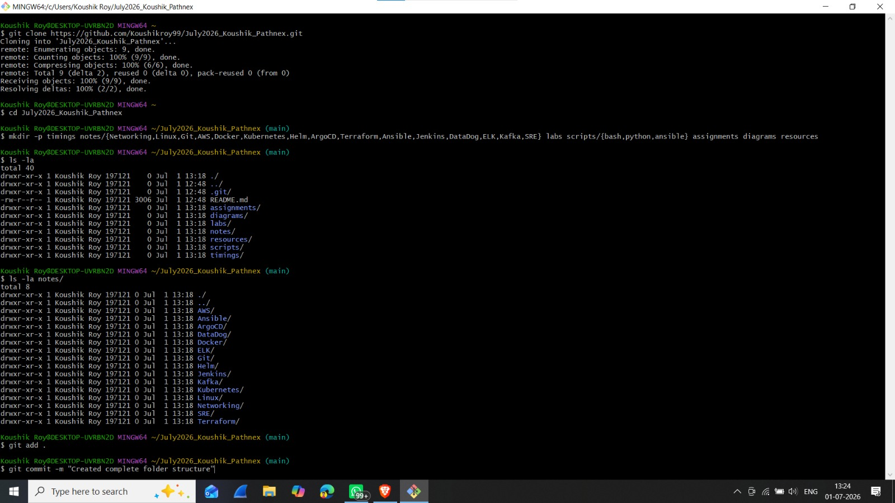
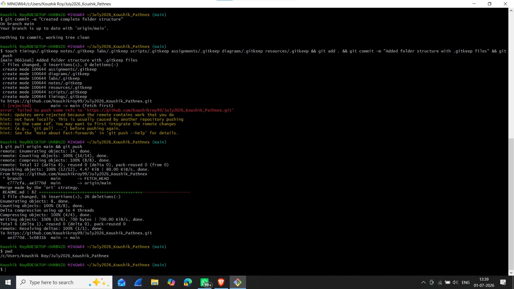
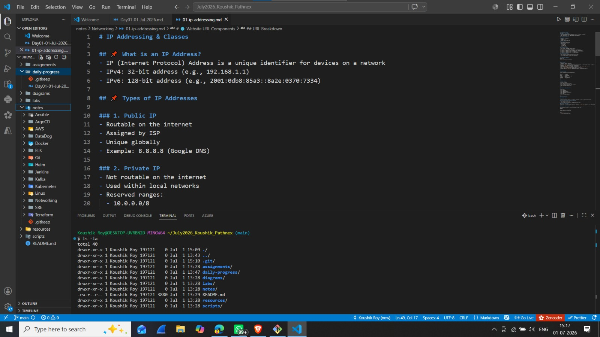

# 📅 Day 01 - 01 July 2026

## 🌅 Morning Class (06:00 AM – 09:00 AM)

### Topics Covered
- Course Introduction
- GitHub Repository Setup

### Assignment
- ✅ Create GitHub Repository
- ✅ Invite Trainer as Collaborator
- 📖 Study:
  - IP Address
  - IP Address Types
  - Public IP
  - Private IP
  - Subnet
  - Website URL

---

### 📸 Git Bash Terminal Screenshots

#### 1. Git Bash Terminal Structure

#### 2. Git Bash Terminal Structure (Additional)

---

## 🌆 Evening Class (07:00 PM – 09:00 PM)

Status: ⏳ Pending

---

## 📝 Self Study

- [ ] [IP Address Classes](../notes/Networking/01-ip-addressing.md#ip-address-classes)
  - Learn about Class A, B, C, D, E – their ranges, subnet masks, and purposes
- [ ] [Public vs Private IP](../notes/Networking/01-ip-addressing.md#types-of-ip-addresses)
  - Understand the difference between routable public IPs and internal private IPs
- [ ] [CIDR & Subnet Basics](../notes/Networking/01-ip-addressing.md#subnet--subnet-mask)
  - Master CIDR notation (/8, /16, /24) and how subnet masks work
- [ ] [Website URL Components](../notes/Networking/01-ip-addressing.md#website-url-components)
  - Break down URLs into Protocol, Domain, Path, Query String, and Fragment
---

### 📸 IP Addressing Resource

---

## ✅ Today's Progress

- Repository Created ✅
- Collaborator Added ✅
- Self Study 🔄
- Evening Class ⏳

---

## 🔗 Resources Used
- [IP Addressing - NetworkLessons](https://networklessons.com/cisco/ccna-200-301/internet-protocol)
